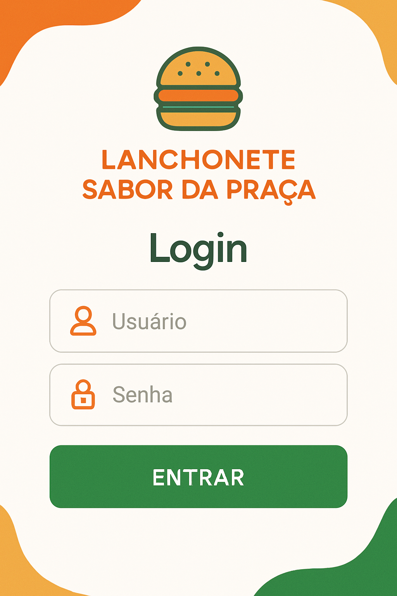
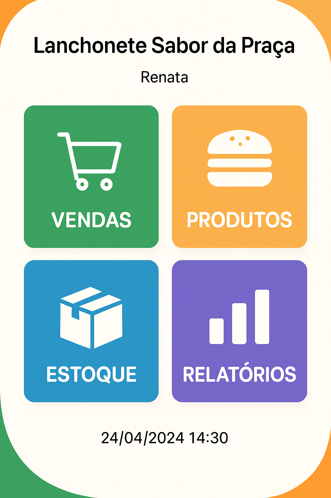
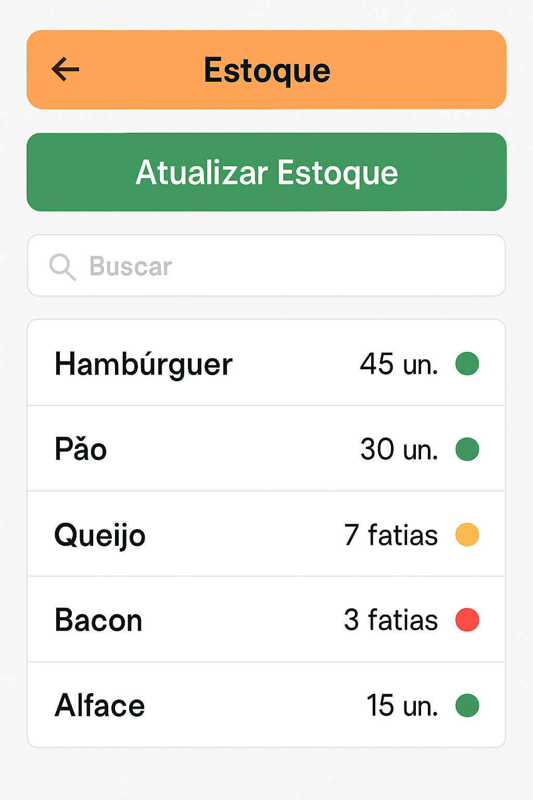
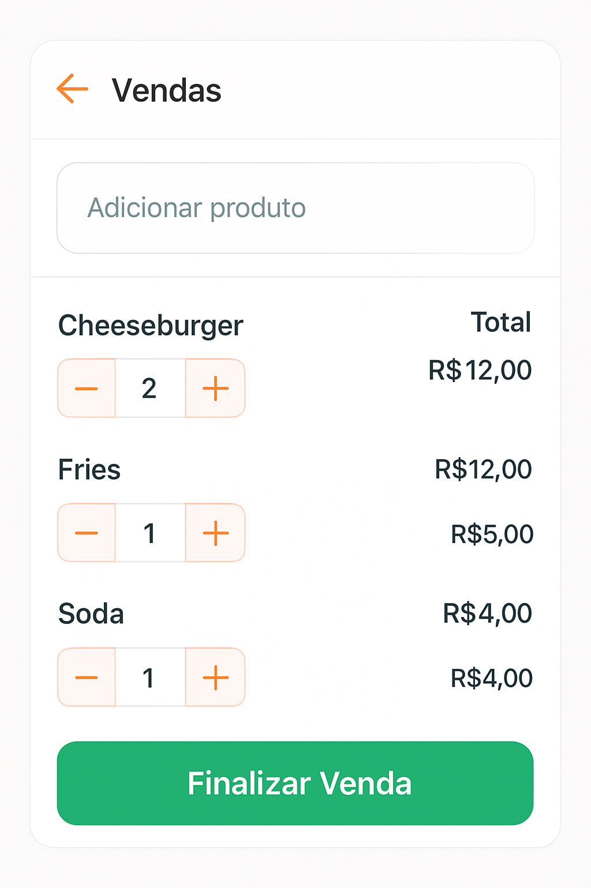

# 🍔 Sabor da Praça - Sistema de Gestão para Lanchonete

<p align="center">
  
</p>


## 📋 Sobre o Projeto

O **Sabor da Praça** é um sistema de gestão desenvolvido especialmente para a Lanchonete Sabor da Praça, um pequeno negócio familiar localizado na região central de Campinas/SP. Este projeto nasceu da necessidade de transformar processos manuais em soluções digitais acessíveis, proporcionando mais eficiência e organização ao dia a dia do estabelecimento.

### 🔍 Contexto e Problema

Atualmente, a lanchonete realiza todo o controle de vendas, estoque e pedidos de forma manual, utilizando cadernos e planilhas simples. Essa abordagem gera diversos problemas:

- Erros frequentes no registro de vendas
- Desperdício de insumos por falta de controle adequado
- Dificuldades na previsão de compras e reposições
- Atrasos no atendimento ao cliente
- Ausência de relatórios para tomada de decisões estratégicas

### 💡 Solução Proposta

Um aplicativo web intuitivo e simplificado, pensado especificamente para usuários com pouca familiaridade tecnológica, que automatiza as principais rotinas administrativas da lanchonete:

- Registro digital de vendas
- Controle de estoque em tempo real
- Cadastro e gerenciamento de produtos
- Geração de relatórios simples e visuais

### 🌱 Impacto Social

Este projeto vai além da simples digitalização de processos. Ele representa uma ferramenta de inclusão digital e fortalecimento de pequenos negócios locais, contribuindo para:

- Sustentabilidade econômica do empreendimento familiar
- Redução de desperdícios e melhor gestão de recursos
- Melhoria na qualidade do serviço oferecido à comunidade
- Geração e manutenção de empregos locais

## ✨ Funcionalidades

### 🔐 Autenticação e Segurança
- Login seguro para controle de acesso
- Diferentes níveis de permissão para funcionários

### 🛒 Gestão de Vendas
- Registro rápido de pedidos
- Cálculo automático de valores
- Opções de pagamento (dinheiro/cartão)
- Finalização de vendas com comprovante

### 📦 Controle de Estoque
- Monitoramento em tempo real dos insumos
- Alertas visuais para itens com estoque baixo
- Registro de entradas e saídas
- Histórico de movimentações

### 🍕 Cadastro de Produtos
- Registro detalhado de itens do cardápio
- Categorização de produtos
- Precificação e controle de custos
- Opção para adicionar imagens

### 📊 Relatórios e Análises
- Visualização de vendas diárias, semanais e mensais
- Ranking de produtos mais vendidos
- Análise de desempenho
- Exportação de dados

## 📱 Screenshots

### Tela de Login
<p align="center">
  
</p>
Interface limpa com logo da lanchonete, campos para usuário e senha bem espaçados e botão grande de "ENTRAR".

### Dashboard Principal
<p align="center">
  
</p>
Menu principal com quatro grandes botões coloridos para acesso às principais funcionalidades.

### Gestão de Produtos
<p align="center">
  
</p>
Lista de produtos cadastrados com nome, preço e categoria, com botão para adicionar novos itens.

### Controle de Estoque
<p align="center">
  
</p>
Controle visual de insumos com indicadores coloridos de nível para facilitar a identificação de itens que precisam de reposição.

### Registro de Vendas
<p align="center">
  
</p>
Interface para registro de pedidos com adição de produtos, ajuste de quantidades e visualização do valor total.

### Relatórios
<p align="center">
  
</p>
Acesso a diferentes tipos de relatórios em formato de cards e gráfico simplificado de vendas semanais.

## 🛠️ Tecnologias Sugeridas

### Frontend
- HTML5, CSS3, JavaScript
- Framework: React.js ou Vue.js
- Biblioteca UI: Bootstrap ou Material-UI
- Responsividade para acesso via dispositivos móveis

### Backend
- Node.js com Express
- Banco de dados: MongoDB ou MySQL
- API RESTful para comunicação com frontend
- Autenticação JWT

### Design e Prototipação
- Figma para wireframes e protótipos
- Princípios de UI/UX focados em simplicidade e acessibilidade

## 📥 Instalação e Configuração

### Pré-requisitos
- Node.js (v14.0.0 ou superior)
- NPM ou Yarn
- Banco de dados (MongoDB ou MySQL)
- Git

### Passos para Instalação

1. Clone o repositório
```bash
git clone https://github.com/seu-usuario/sabor-da-praca.git
cd sabor-da-praca
```

2. Instale as dependências
```bash
npm install
# ou
yarn install
```

3. Configure as variáveis de ambiente
```bash
cp .env.example .env
# Edite o arquivo .env com suas configurações
```

4. Inicie o servidor de desenvolvimento
```bash
npm run dev
# ou
yarn dev
```

5. Acesse a aplicação
```
http://localhost:3000
```

## 📖 Como Usar

### Primeiro Acesso
1. Faça login com as credenciais padrão (admin/admin)
2. Altere a senha padrão no primeiro acesso
3. Configure os dados básicos da lanchonete

### Cadastro de Produtos
1. Acesse a seção "Produtos"
2. Clique em "Adicionar Produto"
3. Preencha os dados do produto (nome, preço, categoria)
4. Adicione uma imagem (opcional)
5. Clique em "Salvar"

### Registro de Vendas
1. Acesse a seção "Vendas"
2. Adicione produtos ao pedido
3. Ajuste as quantidades conforme necessário
4. Selecione a forma de pagamento
5. Finalize a venda

### Controle de Estoque
1. Acesse a seção "Estoque"
2. Visualize os níveis atuais de cada item
3. Clique em "Atualizar Estoque" para registrar entradas
4. Monitore os alertas de itens com estoque baixo

### Relatórios
1. Acesse a seção "Relatórios"
2. Selecione o tipo de relatório desejado
3. Filtre por período (dia, semana, mês)
4. Exporte os dados se necessário

## 🚀 Roadmap

- **Fase 1 (Atual)**: Prototipação e design das telas
- **Fase 2**: Desenvolvimento do frontend e backend básicos
- **Fase 3**: Implementação de todas as funcionalidades
- **Fase 4**: Testes com usuários reais e ajustes
- **Fase 5**: Lançamento da versão 1.0 e treinamento dos usuários

### Melhorias Futuras
- Aplicativo móvel para acesso em smartphones
- Sistema de fidelidade para clientes
- Integração com serviços de delivery
- Dashboard avançado com análises preditivas
- Módulo financeiro completo

## 👥 Como Contribuir

1. Faça um Fork do projeto
2. Crie uma Branch para sua Feature (`git checkout -b feature/AmazingFeature`)
3. Adicione suas mudanças (`git add .`)
4. Comite suas mudanças (`git commit -m 'Add some AmazingFeature'`)
5. Faça o Push da Branch (`git push origin feature/AmazingFeature`)
6. Abra um Pull Request

### Diretrizes de Contribuição
- Mantenha o código limpo e bem documentado
- Siga os padrões de design estabelecidos
- Priorize a simplicidade e acessibilidade nas interfaces
- Teste suas alterações antes de submeter

## 👨‍💻 Equipe e Colaboradores

### Desenvolvedores
- [Seu Nome](https://github.com/seu-usuario) - Desenvolvedor Principal

### Parceiros
- **Lanchonete Sabor da Praça**
  - Sra. Maria Aparecida da Silva (Proprietária)
  - Sr. João Carlos da Silva (Cozinha e Compras)
  - Ana Paula da Silva (Auxiliar Geral)

## 📄 Licença

Este projeto está licenciado sob a Licença MIT - veja o arquivo [LICENSE.md](LICENSE.md) para detalhes.

## 🙏 Agradecimentos

- À família Silva por abrir as portas da Lanchonete Sabor da Praça para este projeto
- Aos professores e colegas que contribuíram com ideias e feedback
- À comunidade open source pelas ferramentas e bibliotecas utilizadas

---

<p align="center">
  Desenvolvido com ❤️ para a Lanchonete Sabor da Praça
</p>
